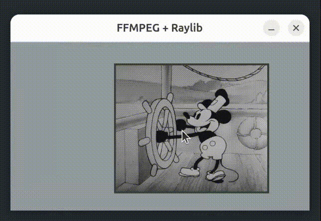

# Raylib with FFmpeg - Audio/Video Rendering Example

A simple example showcasing how to use FFmpeg (the executable) with Raylib to render audio and video content.

If you find this example useful, consider buying me a beer! 🍺
https://paypal.me/andreafontana/5

## Description

This project demonstrates how to integrate FFmpeg (via command line) with Raylib to:
- Play video content
- Handle synchronized audio
- Manipulate display in real-time

Since it leverages FFmpeg's extensive codec support, this solution can play almost any video format, even rare or exotic ones that FFmpeg can read.

## Controls

- **Mouse**: Drag video around the window
- **Mouse Wheel**: Zoom in/out video content

## Requirements

- FFmpeg installed and available in system PATH
- Raylib

## Note

This example uses FFmpeg as an external executable and not the native libraries (libavcodec, libavformat, etc.). This approach greatly simplifies the implementation while maintaining good performance for basic use cases.
